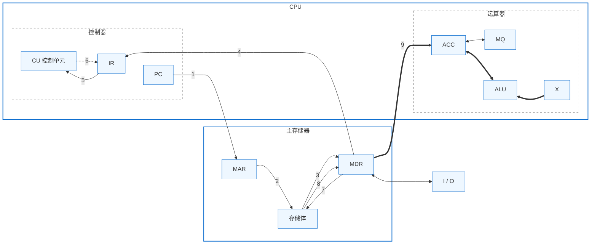

文章是基于托马斯微积分中文第十版做的笔记，严格概念会引用同济版高等数学的表述。过于简单的知识就一句带过或者省略
# 极限
先来看函数极限的公式
$$
\lim\limits_{x\to x_0}f(x)=L
$$
这里的$x_0$是一个常数，但是这就引申出一个问题，假设$\Delta x=\vert x-x_0\vert $，$\Delta x$得多小才符合上面的式子求出$L$，另外要问的是$\Delta x$是否就等于0。为了严谨的定义极限，就有了$\varepsilon — \delta$语言，以下是函数极限的正式定义。
> #### 定义1 函数的极限
> 设$f(x)$定义在$x_0$的一个可能不包括$x_0$的开区间上，我们说$x$趋于$x_0$时$f(x)$趋于极限$L$，并记为
> $$
> \lim\limits_{x\to x_0}f(x)=L
> $$
> 如果，对任何数$\varepsilon>0$，存在对应的数$\delta>0$使得对所有满足$0<\vert x-x_0\vert<\delta$的$x$,有
> $$
> \vert f(x)-L\vert<\varepsilon
> $$

对于上述的定义十分的抽象晦涩，那我们用高中导数部分的$\Delta x$和$\Delta y$来分别换掉$\vert x-x_0\vert$和$\vert f(x)-L\vert$时，虽然它并不准确，但能帮助我们理解，表述如下：
$$
\forall\varepsilon>0，\exists\delta>0，当0<\Delta x<\delta时，有\Delta y<\varepsilon
$$
简单的说，也就是$y$轴上变化任意小量时，总能找到对应的$\delta$邻域$(x_0-\delta,x_0+\delta)$存在。
## 极限的存在
极限有可能不存在，什么情况下才会不存在呢，直接给出结论，以下三种情况不存在：

1. 函数跳跃:分段函数的情况，左极限不等于右极限。
2. 函数无限增大:在某点趋于无穷，比如说反比例函数在0处趋于无穷。
3. 函数无限振动。
# 极限的运算
正常求极限非常简单，只要把$x_0$代入函数即可。当然极限也有运算法则。

## 定理1 极限法则

如果$L，M，c$和$k$都是实数，且
$$
\lim\limits_{x\to c}f(x)=L 和 \lim\limits_{x\to c}g(x)=M,那么
$$
有：
- 和法则：$\lim\limits_{x\to c}(f(x)+g(x))=L+M$

- 差法则：$\lim\limits_{x \to c} (f(x) - g(x)) = L - M$

- 积法则：$\lim\limits_{x \to c} (f(x) \cdot g(x)) = L \cdot M$

- 乘常数法则：$\lim\limits_{x \to c} (k \cdot f(x)) = k \cdot L$

- 商法则：$\lim\limits_{x \to c} \frac{f(x)}{g(x)} = \frac{L}{M}, \quad M \neq 0$

- 幂法则：如果 $r$ 和 $s$ 都是整数，$s \neq 0$，那么

$$
\lim_{x \to c} (f(x))^{\frac{r}{s}} = L^{\frac{r}{s}}
$$
(注：若 $s$ 是偶数，则假设 $L > 0$)

## 定理2 可用代入法求多项式的极限

如果 $P(x) = a_n x^n + a_{n-1} x^{n-1} + \dots + a_0$，那么：

$$
\lim_{x \to c} P(x) = P(c) = a_n c^n + a_{n-1} c^{n-1} + \dots + a_0
$$

## 定理3 可用代入法求有理函数的极限，当分母的极限不等于零

如果 $P(x)$ 和 $Q(x)$ 都是多项式且 $Q(c) \neq 0$，那么：

$$
\lim_{x \to c} \frac{P(x)}{Q(x)} = \frac{P(c)}{Q(c)}
$$

## 定理 4 三明治（夹逼）定理

假设在包含 $c$ 在内的某个开区间中除 $x = c$ 外所有的 $x$，有 $g(x) \le f(x) \le h(x)$。又假设：

$$
\lim_{x \to c} g(x) = \lim_{x \to c} h(x) = L
$$

那么$\lim\limits_{x\to c}f(x)=L$。

# 练习 1.1
1. $\lim\limits_{x \to -3} (x^2 - 13)$

2. $\lim\limits_{x \to 2} (-x^2 + 5x - 2)$
3. $\lim\limits_{t \to 6} 8(t - 5)(t - 7)$
4. $\lim\limits_{x \to -2} (x^3 - 2x^2 + 4x + 8)$
5. $\lim\limits_{x \to 2} \frac{2x + 5}{11 - x^3}$
6. $\lim\limits_{s \to \frac{2}{3}} (8 - 3s)(2s - 1)$
7. $\lim\limits_{x \to -\frac{1}{2}} 4x(3x + 4)^2$
8. $\lim\limits_{y \to 2} \frac{y + 2}{y^2 + 5y + 6}$
9. $\lim\limits_{y \to -3} (5 - y)^{\frac{4}{3}}$
10. $\lim\limits_{z \to 4} \sqrt{z^2 - 10}$
11. $\lim\limits_{h \to 0} \frac{3}{\sqrt{3h + 1} + 1}$
12. $\lim\limits_{h \to 0} \frac{\sqrt{5h + 4} - 2}{h}$
13. 不等式
$$
1 - \frac{x^2}{6} < \frac{x \sin x}{2 - 2\cos x} < 1
$$
对所有接近 $0$ 的 $x$ 成立。求：
$$
\lim_{x \to 0} \frac{x \sin x}{2 - 2\cos x}
$$
14. 不等式
$$
\frac{1}{2} - \frac{x^2}{24} < \frac{1 - \cos x}{x^2} < \frac{1}{2}
$$
对接近零的 $x$ 值成立。求：
$$
\lim_{x \to 0} \frac{1 - \cos x}{x^2}
$$

